# Среща 1 - Основни характеристики на Golang

#### 💡 Какво разгледахме днес
- Защо Golang и как може да ни е полезен
- Инсталация на компилатора и подготовка на среда за разработка
- Първия ни Hello World проект
- Променливи и вградени примитивни типове
- Контролни структури 
- Работа с вградени типове за колекции
- Работа със структури и потребителски дефинирани типове

За целите на този курс имаме два възможни варианта за инсталация на Golang като среда за разработка:
- Архивирана версия - особено в случаи, в които нямаме права за инсталация на exe-то. (**особено в рамките на компютърната зала във ФМИ**)
- Версия за инсталация - препоръчвам във всички случай, защото спестява много безмислено търсене на команди

Така че смело посетета офицялния адрес съдържащ последната версия на компилатора на Golang и дръпнете правилната разфасовка за вашия сценарии.

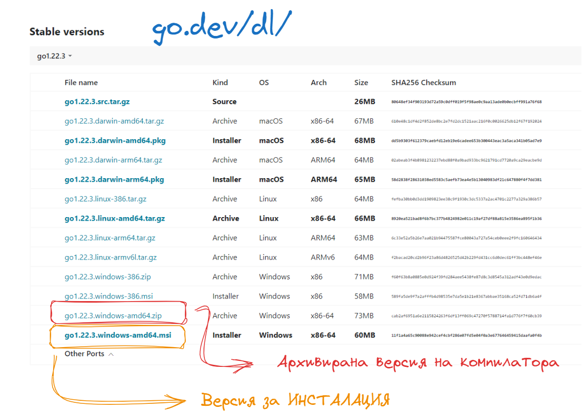

## Среда за разработка

Към момента на пазара има две популярни решения, за разработка на Golang проекти:
- [GoLand на JetBrains](https://www.jetbrains.com/go/) - напълно оборудвано IDE от JetBrains. Продукта улеснява неимоверно работата с Go базирани проекти, поради факта че съдържа в себе си цялостния workflow и инструменти за управление на качеството на кода. Продукта е платен, но всичкки студенти и енстусиасти могат да се възползват от учебен лиценз или пробна 30 дневна версия.
- [VsCode](https://code.visualstudio.com/) с плъгин за [Golang](https://marketplace.visualstudio.com/items?itemName=golang.go)- VSCode няма нужда от представяне. Плъгина за GoLang предоставя базови синтактични правила и дописване на код. На моменти не реагира достатъчно адекватно, но за целите на нашето обучение ще свърши напълно адекватна работа.

## Как да си направим нов проект

След като инсталираме нашия Go компилатор можем да създадем задължителния ни Hello World проект. За тази цел ще си създадем една нова директория, в която ще разпишем нашия код. Ако не сте го направили сега е момента да се запознаете с нашия стартов проект, с които ще разгледаме основите на езика. 

Като за начало ще започнем с най-елементарния код, за който можем да се сетим. Go е основно процедурен език за програмиране и както повечето такива задължително трябва да инициализираме **main функция** , от която стартира нашето приложение.

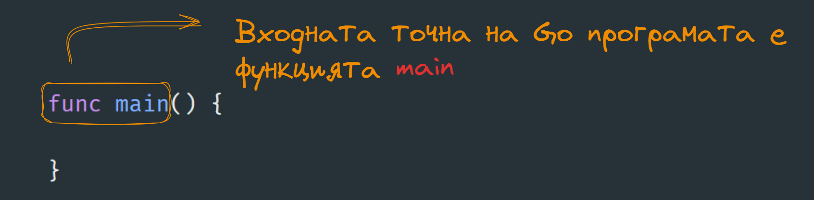

Няколко особености:
- имаме само една единствена функция main - в рамките на нашия проект.
- всички функции се записват с ключовата дума **func**

### Да визуализираме малко текст

За да работим с входно изходни потоци от данни е необходимо да използваме **ПАКЕТ от функционалности**, част от **стандартната библиотека** на езика. За референция и бъдещи справки, можете да посетите [този линк](https://pkg.go.dev/std) и да видите всички вградени функционалности в Go.

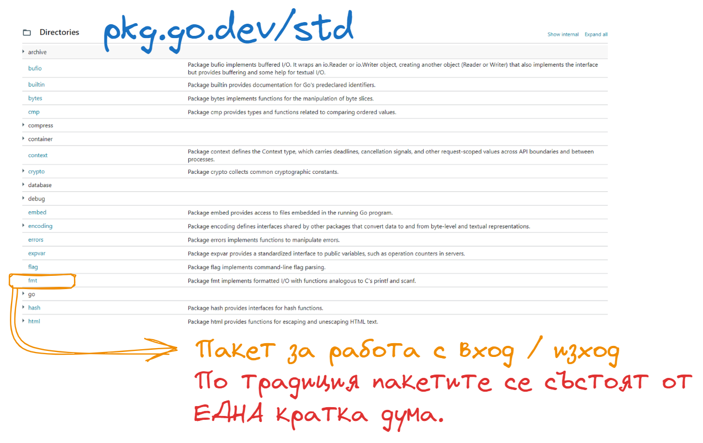

Името на пакета е малко странно и то е **fmt** - което е съкращение от формат. Някой от имената на пакетите, са меко казано странни, но бързо се свиква. 
За да добавим пакет към файла ползваме командата **import** и името на пакета. 

За да визуализираме какъвто и да е текст, числа и прочие данни ползваме функцията **Print** която е част от пакета. 

Две важно особености:
- Go е доста ориентиран към конвенциите - тоест ако пишете кода по определен начин, се случват специфични неща без да е необходимо да ползвате специални или ключови думи. В този случай главните букви в имената на функциите не са за красота а те имат доста специфично влияние върху кода.
- Go се стреми да опростява част от операциите. Поради тази причина класическата точка и запетая е премахната, като оператор за край на даден израз. 

### Всичкия код в Golang е пакет

Пакета за визуализация на текст, е един от многото примери за пакети съдържащи функционалност. Това е един от начините по които Go организира кода си. Ако се опитаме да стартираме кода който разписахме до момента ще установим че компилатора не е доволен точно поради причината, че този код не се намира в нито един пакет. По подразбиране пакета които съдържа **main** функцията се казва **main**. Пакета (подобно на много други езици за програмиране), се декларира в началото на файла с помоща на ключовата дума **package**

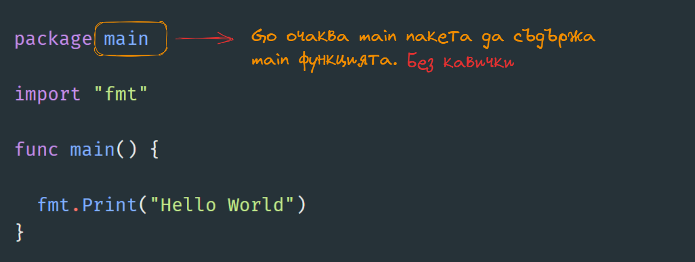

### Нека да стартираме приложението и да видим резултата

За да стартираме приложението си ще ползваме командите, които Golang компилатора ни предоставя. Затова смело отворете вашата конзола и се позиционирайте в директорията на проекта.

Ако всичко е изпълнено успешно ще видите на екрана на конзолата, текстовото съобщение, което сте написали. На този етап ще ползваме, командата run за да изпълняваме новосъздадените проекти. В последствие ще разгледаме и алтернативни подходи за създаване и изпълнение на приложението, които са доста по подходящи за продукционна среда. 

## Променливи и примитивни типове данни

Ще расегнем само няколко дребни особености на Go които са интересни, за ентусиастите, които прохождат в езика. Go е статично типизиран език, което значи че винаги в картинката е намесен някакъв тип. Примитивните типове от данни, са същите с които вече сте запознати:
- int
- float 
- string
- bool
Синтактично съществуват няколко начина да декларираме променливи, да си представим че искаме да съхраним информация за потребител:
- възраст
- височина
- дали е член на супер специалния клуб на програмистите

### Декларация и инициализация в един ред

Ако икскаме компилатора, да предположи какъв е типът данни от стойността, която присвояваме - е необходимо да използваме ключовата дума **var** пред идентификатора на променливата. 

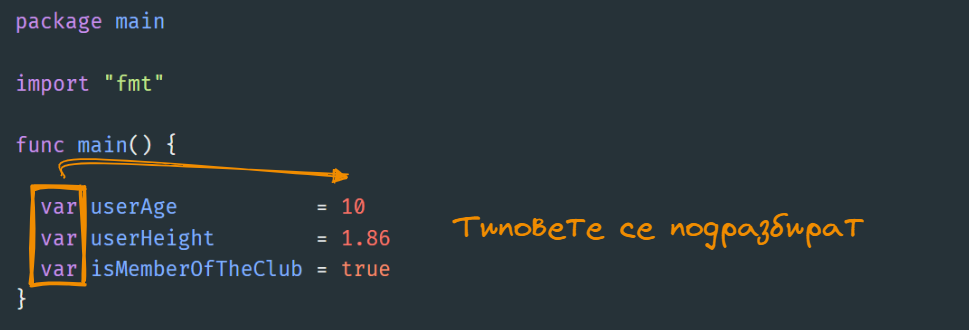

Важна особеност в Go е, че веднъж присвоен типът, той не може да се промени повече, дори да не го виждаме изрично зад кулисите компилатора казва тази променлива е само INT или FLOAT или BOOL и няма връщане назад.

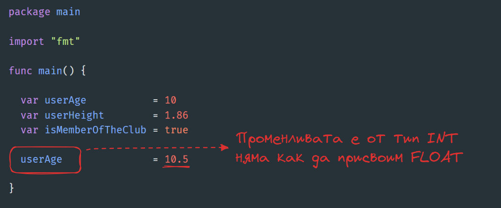

### Декларация и последващо присвояване на стойност

Ако не инициализираме веднага променливите, компилатора на GO няма идея какви типове да закачи към променливите. Поради тази причина, ако нямаме идея каква стойност да сложим, трябва изрично да добавим типът на данните непосредствено след името на променливата. 

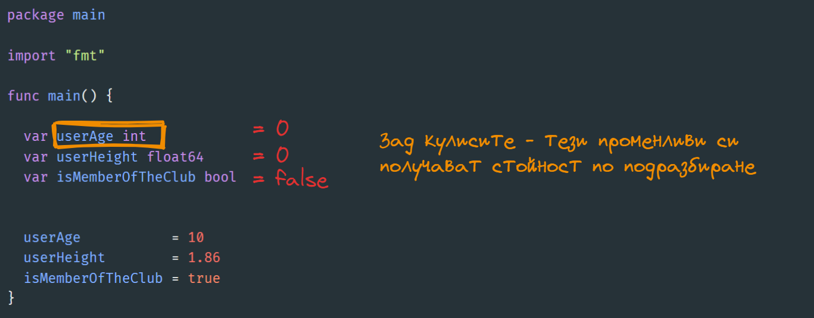

### Съкратен запис за декларация и просвояване

Ако ни мързи да пишем **var** пред името на променливата и да ползваме силата на Go да открива какъв е типът на данните, които присвояваме на променливите - можем да ползваме оператора **:=**. 

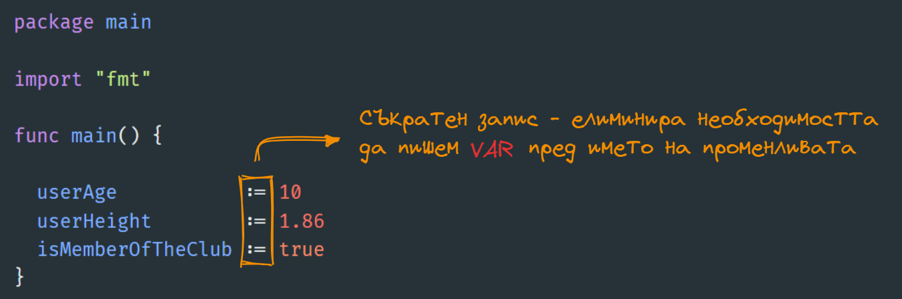

### Константи
---

### Защо не мога да си пусна програмата - особености на Go ?
Ако сме следвали примерите до тук ще установите - че тези програми няма да могат да стартират, поради странни напръв поглед несъществуващи грешки. Go се опитва да елиминира нашата несъобразителност и разхвърляност в рамките на програмата, като предизвиква синтактична грешка в момента в която дадена променлива не е използвана в програмата.

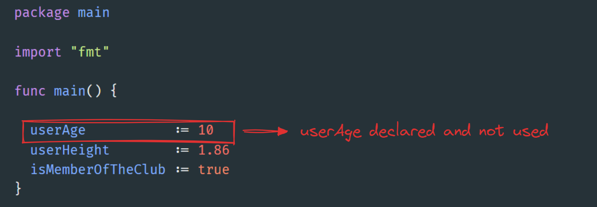

Наи лесния начин да пречупим желанието на компилатора да ни се кара е като подпъхнем променливата в рамките на някаква операция, в нашия случай такава за принтиране на текст на екрана. 

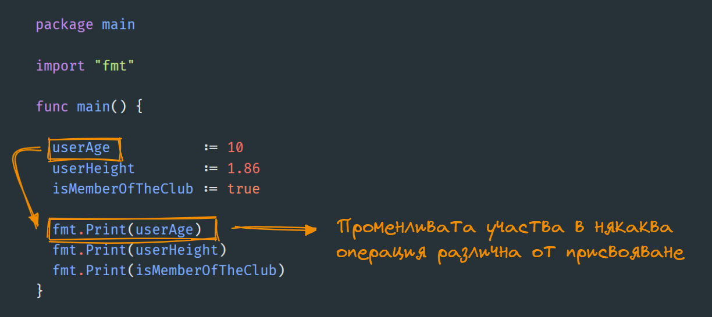

## Условни конструкции

Няма да се изненадате но Golang поддържа стандартните контролни структури с които можем да определяме потока на нашите данни. Крайгълния камък на програмирането IF / ELSE конструкцията. Да продължим примера от преди малко ако потребителя е част от супер тайния ни клуб то тогава ще го поздравим в противен случай ще му поистаме такса за вход.

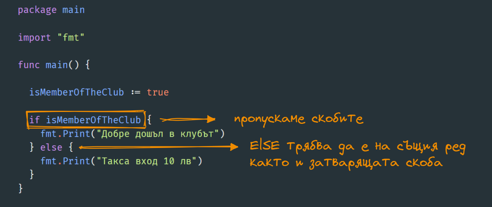

Отново да адресираме особеностите в синтаксиса:
- пропускаме отварящата и затваряща малка скоба непосредствено след IF-a;
- фигурните скоби са напълно задължителни
- else конструкцията трябва да е непосредствено след затварящата фигурна скоба - иначе ще получил синтактична грешка.

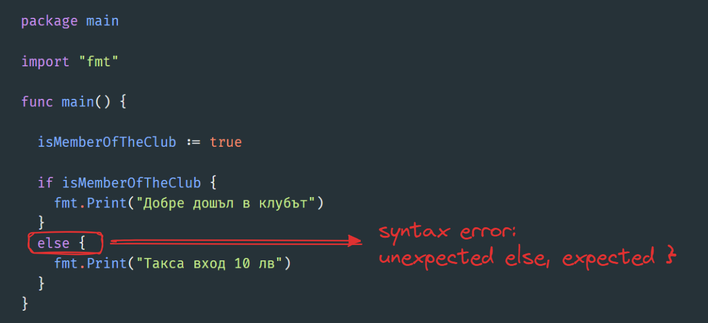

## Цикли

Дизайнерите на Go в своето търсене на най-лесния механизъм за справяне с проблемите - са решили да имплементират само и единствено една конструкция за цикли и това е добрия стар и брутално използван FOR цикъл. Той може да се ползва както като WHILE така и като FOR брояч (очевидно).

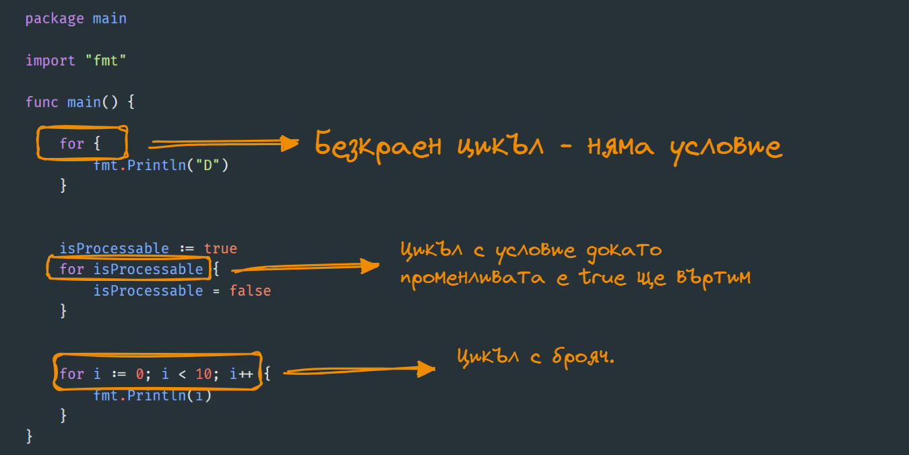

## Колекции

На наше разположение са три вида колекции в които можем да съхраняваме голямо количество информация.
- Масив             - фиксиран набор от елементи от един и същи тип
- Слаисове          - или с две думи динамичен масив.
- Мапове / Речници  - структура предоставяща ключ и стойност за бързо индексиране на специфична информация

И трите колекции се подчиняват на общи идеи и правила при работа с тях

### Масиви

Масивите ни дават възможност да съхраним предварително фиксиран набор от стойности, с които да работим с помоща на индекс. Верни на силно типизираната природата на Go всеки масив съдържа типово хомогенни елементи. 

Да разгледаме следния пример. Миналия месец беше топъл и сме решили да съберем данните за максималната температура за всеки ден от седмицата. Нека да ги запазим в един масив от цели числа. 

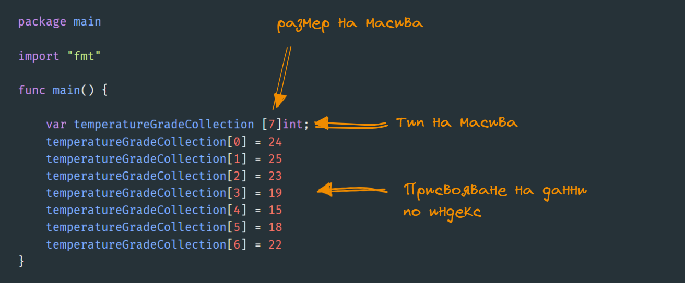

Разбира се можем да си спестим и цялото това изреждане на променливата и нейния индекс като инициализираме масива директно.

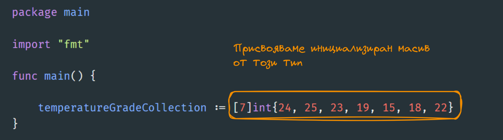

Количеството на елементите е опционално така че ако премахнем фиксирания размер, в този случай 7 системата автоматично ще си сметне размера в зависимост от бройката на елементите.

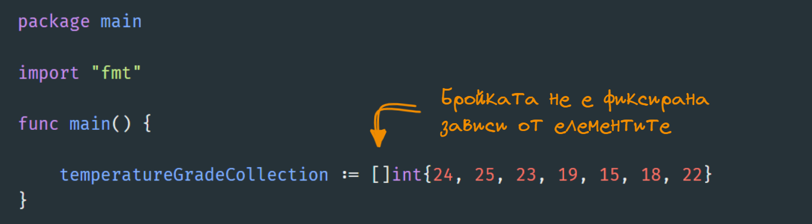

### Слайсове

Слайса е **механизъм**, с който можем да накараме определен масив да расте динамично. Или иначе казано можем да създаваме нов масив, които динамично да променя своя размер при добавяне или премахване на елемент. Единствената уловка в случая е че не трябва да декларираме никаква размерност на масива при неговото създаване (проста работа).

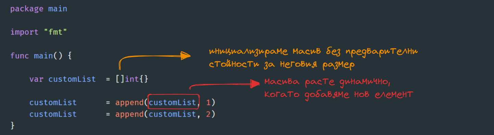

### Карти / Речници 

Речника е масив, в който вместо числов индекс ние използваме ключ с произволна стойност. Колекцията е не подредена и се ползва за лесно достъпване на опредлена стойност на базата на същия ключ.

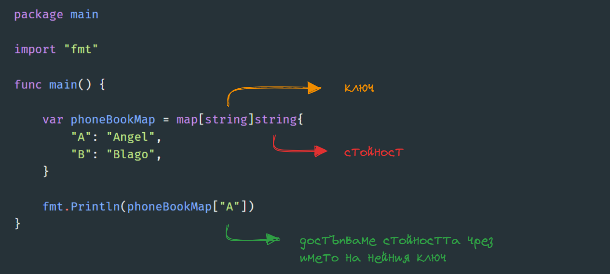

### Обхождане на колекции с помоща на цикъл

Всички колекции, които могат да бъдат достъпени с помоща на числов индекс важи правилото, че могат да бъдат обходени с цикъл с брояч. 

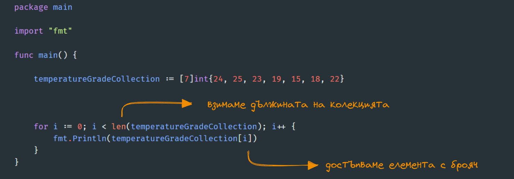

GO ни дава и допълнителна конструкция **range**, която наподобява FOREACH / FOR IN / FOR : версиите на цикли познати ни от други езици. Тази конструкция ни връща стойноста на колекцията и неговия индекс.

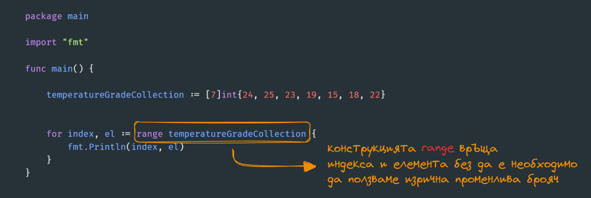

## Функции

Както вече казахме Golang е процедурен език с функционални възможности. Огромна част от вашите програми ще съдържат множество от функции в които ще се случва огромна част от логиката на приложението ви. За разлика от повечето езици за програмиране GO поддържа концепция за функции които връщат множество стойности, което е причина и за някой странности в синтаксиса. Но да започнем с нещо просто.

Ще си напишем функция която получава информация за нашия клиент първо и второ име и възраст. Ако потребителя е над 18 години ще кажем че той има достъп до нашия таен клуб в противен случай ще му напомним че трябва да порастне. 

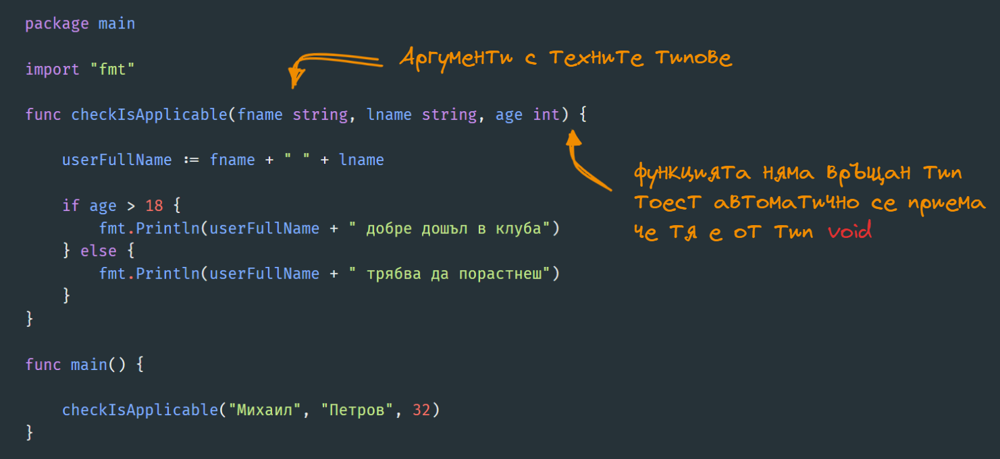

### Функции с връщан тип

Нека да направим лека промяна във функцията така че да се проверява дали потребителя е достатъчно възрастен да е част от клуба. В този случай чожеш да станеш член на крлуба ако е изпълнено някои от тези условия :
- си на 18 години
- се казваш Михаил Петров и си над 16 години

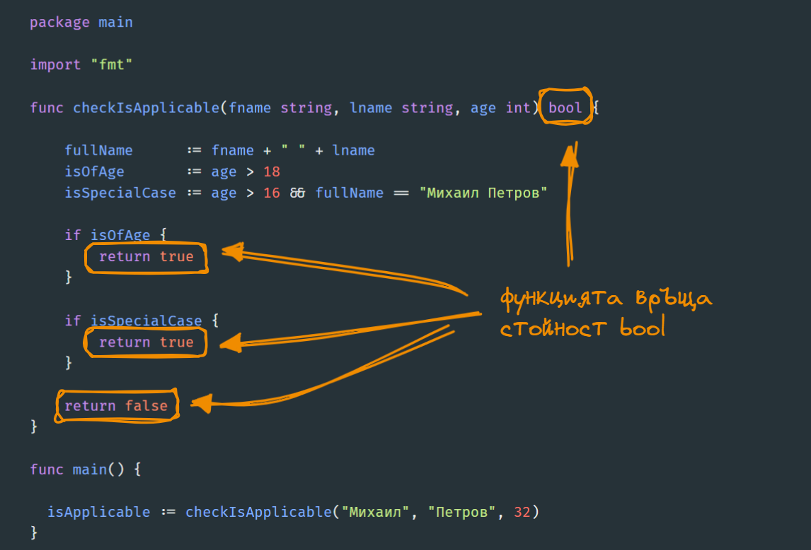

### Връщане на множество стойности

Обикновенно в конвенционалните езици за програмиране всяка функция връща само една единствена стойност, ако изпитаме непреодолимо желание да върнем повече от това лимитарно количество, трябва да се възползваме от някакаква структура в която да опаковаме резултата си. GoLang казва твърдо НЕ и дава на потребителя възможност да връща колкото стойности си иска от дадена функция в определен момент.

Нека да разширим примера ни от преди малко и да върнем освен булевата стойност и пълното име на потребителя.

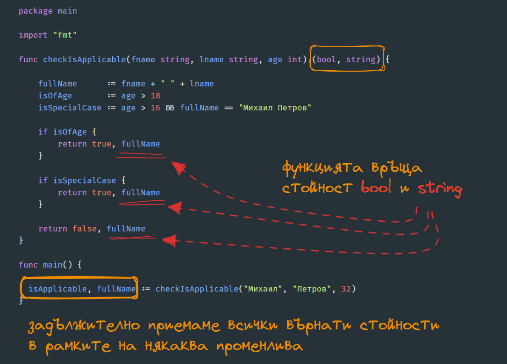

Винаги трябва да връщате всички стойности в момента в който използвате ключовата дума **return**.

С голямата сила идва и голямата безОТГОВОРНОСТ, поради тази причина е добре понякога да постъпваме разумно и да си признаем че или първата или втората променлива ще са ни напълно безполезни. Go ни дава възможност да НЕ присвояваме някоя от връщаните стойности. Това става с помоща на оператора **_**. 

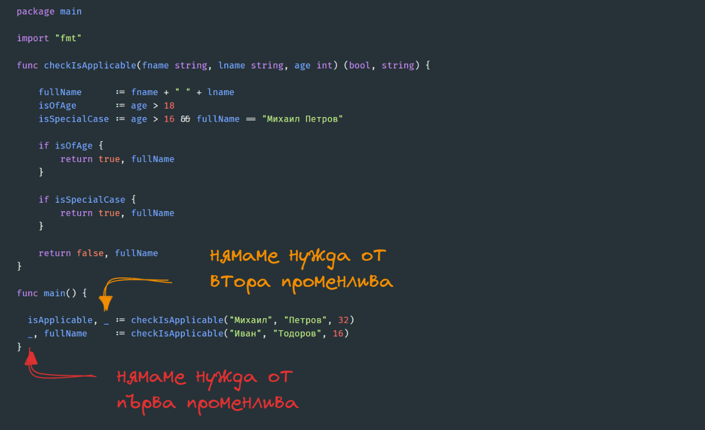

### Какъв е смисъла да връщаме множество стойности ?

Идиоматично и прагматично, ако се замислим много дълбоко обикновенно функцията има логика да връща една стойност и да върщи само една задача. Но тогава защо GoLang може да връща множество. Ами отноговара често е свързан с понятието ГРЕШКА. В GO доста често вторият връщан тип е потенциална грешка която функцията може да върне на потребителя. Ние сме свикнали с идеята за Exception - и и всички готини механизми за тяхната обработка. Е в GO грешките са доста по класически, представляват код или съобщение което ние връщаме в рамките на кода а обработката се случва ръчно от програмиста в рамките на извикването на функцията. 

Ще преправим горния пример така че системата да връща съобщение за грешка ако е налице един от следните сценарии:
- първото или второто име е празен низ
- възрастта е отрицателно число или число по голямо от 120

Това ще бъде и първия ни пример в който ще ползваме пакет различен от **fmt**. Ще си добавим пакета **[errors](https://pkg.go.dev/errors)**. Също така ще премахмен връщането на пълното име на потребителя. 

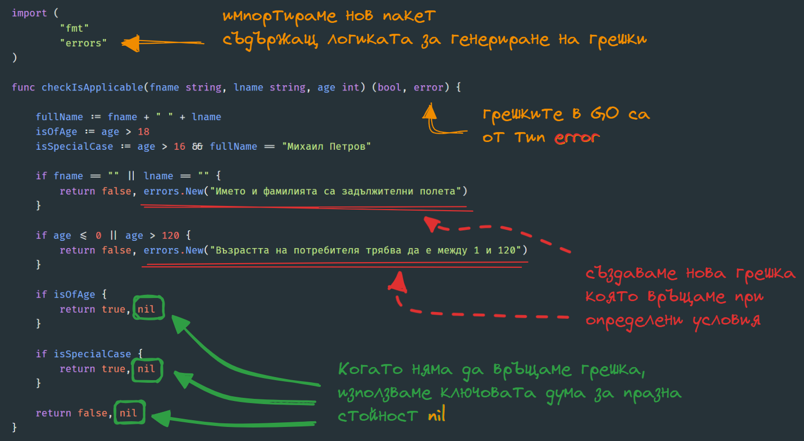

Някой от особеностите в горния код:
- типът error се ползва в рамките на вградения в GO пакет errors, той се ползва във всички програми
- за създаване на нова грешка ползваме конструкцията errors.New като дефинираме съобщение за грешката
- Както забелязахме когато връщаме стойност винаги трябва да върнем всички стойности. Затова където няма грешка, можем да върнем празна стойност **nil**.

### Как се обработват грешките ? 

Шаблока който ще видим се ползва при всички функции, които връщат грешка. В общи линии обработката се свежда до това да проверим дали има грешка или има празна стойност nil.

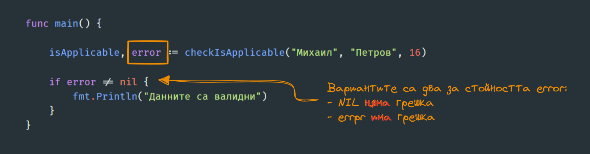

## Потребителски дефинирани типове

Шок и ужас в GO няма класове. Езика поддържа идеи които са ни познати от езици като Java / C# / PHP и други езици съдържащи обектно ориентирана парадигма но в чистия си вид езика е процедурен по своята същност. 

Както знаем класовете ни дават възможност да създаваме потребителски дефинирани типове, в този смисъл GO поддържа подобна система в която можем да си създадем собствен тип, с кореспондиращи към него полета и методи.

### Преименуване на типове

Да започнем с нещо забавно. В Go имаме възможност да преименуваме вградени типове, като по този начин създадем собствена версия на вече съществуващи типове. Например осъзнавам че ме мързи да ползвам дългото название **string** и искам да го заменя с краткото **str** - имам тази възможност на 100%, с помоща на магическата ключова дума **type**

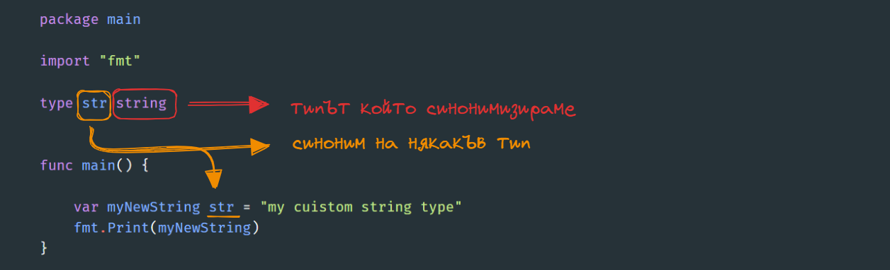

### Работа със структури

Най-близкото нещо до клас в  GoLang е структурата. Тя представлява комплексен набор от полета, обединени под общо название, към което могат да се добавят методи.
