# Среща 1 - Основни характеристики на Golang

#### 💡 Какво разгледахме днес
- Защо Golang и как може да ни е полезен
- Инсталация на компилатора и подготовка на среда за разработка
- Първия ни Hello World проект
- Променливи и вградени примитивни типове
- Контролни структури 
- Работа с вградени типове за колекции
- Работа със структури и потребителски дефинирани типове

За целите на този курс имаме два възможни варианта за инсталация на Golang като среда за разработка:
- Архивирана версия - особено в случаи, в които нямаме права за инсталация на exe-то. (**особено в рамките на компютърната зала във ФМИ**)
- Версия за инсталация - препоръчвам във всички случай, защото спестява много безмислено търсене на команди

Така че смело посетета офицялния адрес съдържащ последната версия на компилатора на Golang и дръпнете правилната разфасовка за вашия сценарии.

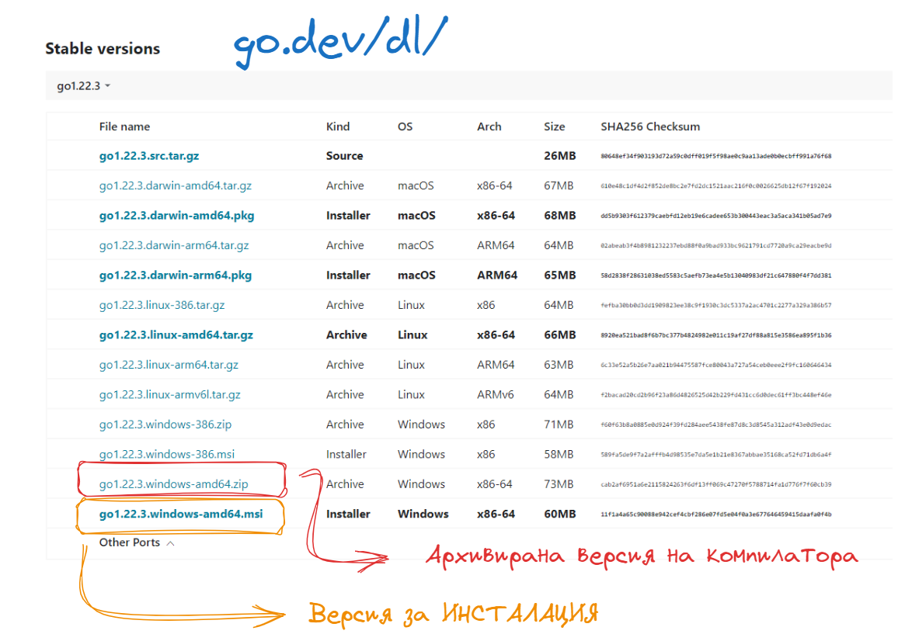

## Среда за разработка

Към момента на пазара има две популярни решения, за разработка на Golang проекти:
- [GoLand на JetBrains](https://www.jetbrains.com/go/) - напълно оборудвано IDE от JetBrains. Продукта улеснява неимоверно работата с Go базирани проекти, поради факта че съдържа в себе си цялостния workflow и инструменти за управление на качеството на кода. Продукта е платен, но всичкки студенти и енстусиасти могат да се възползват от учебен лиценз или пробна 30 дневна версия.
- [VsCode](https://code.visualstudio.com/) с плъгин за [Golang](https://marketplace.visualstudio.com/items?itemName=golang.go)- VSCode няма нужда от представяне. Плъгина за GoLang предоставя базови синтактични правила и дописване на код. На моменти не реагира достатъчно адекватно, но за целите на нашето обучение ще свърши напълно адекватна работа.

## Как да си направим нов проект

След като инсталираме нашия Go компилатор можем да създадем задължителния ни Hello World проект. За тази цел ще си създадем една нова директория, в която ще разпишем нашия код. Ако не сте го направили сега е момента да се запознаете с нашия стартов проект, с които ще разгледаме основите на езика. 

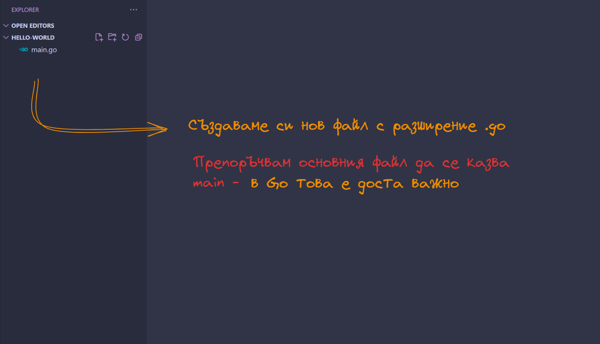

Като за начало ще започнем с най-елементарния код, за който можем да се сетим. Go е основно процедурен език за програмиране и както повечето такива задължително трябва да инициализираме **main функция** , от която стартира нашето приложение.

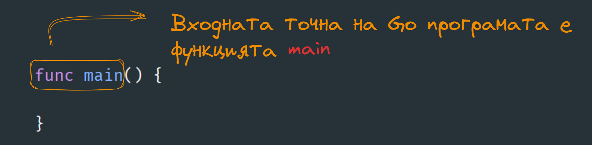

Няколко особености:
- имаме само една единствена функция main - в рамките на нашия проект.
- всички функции се записват с ключовата дума **func**

### Да визуализираме малко текст

За да работим с входно изходни потоци от данни е необходимо да използваме **ПАКЕТ от функционалности**, част от **стандартната библиотека** на езика. За референция и бъдещи справки, можете да посетите [този линк](https://pkg.go.dev/std) и да видите всички вградени функционалности в Go.

Името на пакета е малко странно и то е **fmt** - което е съкращение от формат. Някой от имената на пакетите, са меко казано странни, но бързо се свиква. 
За да добавим пакет към файла ползваме командата **import** и името на пакета. 

За да визуализираме какъвто и да е текст, числа и прочие данни ползваме функцията **Print** която е част от пакета. 

Две важно особености:
- Go е доста ориентиран към конвенциите - тоест ако пишете кода по определен начин, се случват специфични неща без да е необходимо да ползвате специални или ключови думи. В този случай главните букви в имената на функциите не са за красота а те имат доста специфично влияние върху кода.
- Go се стреми да опростява част от операциите. Поради тази причина класическата точка и запетая е премахната, като оператор за край на даден израз. 

### Всичкия код в Golang е пакет

Пакета за визуализация на текст, е един от многото примери за пакети съдържащи функционалност. Това е един от начините по които Go организира кода си. Ако се опитаме да стартираме кода който разписахме до момента ще установим че компилатора не е доволен точно поради причината, че този код не се намира в нито един пакет. По подразбиране пакета които съдържа **main** функцията се казва **main**. Пакета (подобно на много други езици за програмиране), се декларира в началото на файла с помоща на ключовата дума **package**

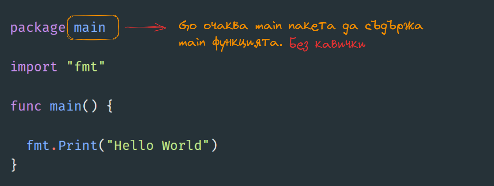

### Нека да стартираме приложението и да видим резултата

За да стартираме приложението си ще ползваме командите, които Golang компилатора ни предоставя. Затова смело отворете вашата конзола и се позиционирайте в директорията на проекта.

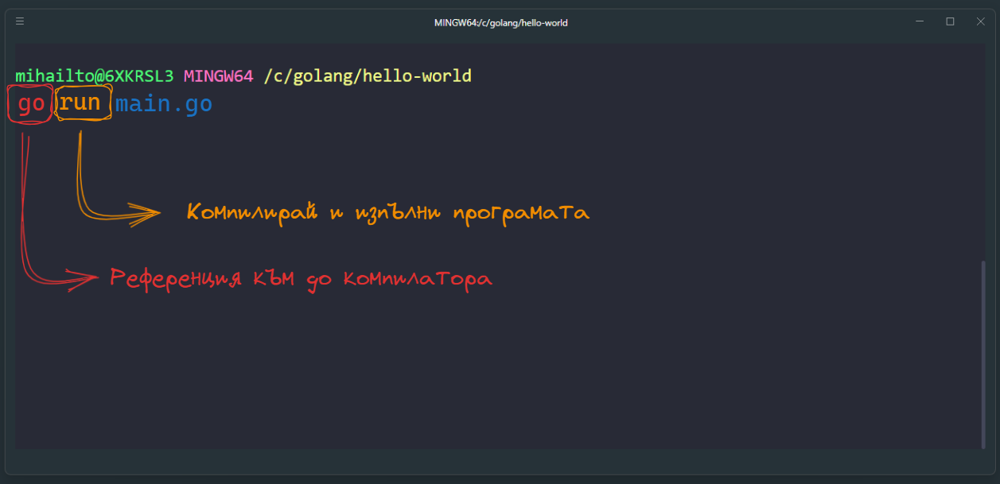

Ако всичко е изпълнено успешно ще видите на екрана на конзолата, текстовото съобщение, което сте написали. На този етап ще ползваме, командата run за да изпълняваме новосъздадените проекти. В последствие ще разгледаме и алтернативни подходи за създаване и изпълнение на приложението, които са доста по подходящи за продукционна среда. 

## Променливи и примитивни типове данни

Ще расегнем само няколко дребни особености на Go които са интересни, за ентусиастите, които прохождат в езика. Go е статично типизиран език, което значи че винаги в картинката е намесен някакъв тип. Примитивните типове от данни, са същите с които вече сте запознати:
- int
- float 
- string
- bool
Синтактично съществуват няколко начина да декларираме променливи, да си представим че искаме да съхраним информация за потребител:
- възраст
- височина
- дали е член на супер специалния клуб на програмистите

### Декларация и инициализация в един ред

Ако икскаме компилатора, да предположи какъв е типът данни от стойността, която присвояваме - е необходимо да използваме ключовата дума **var** пред идентификатора на променливата. 

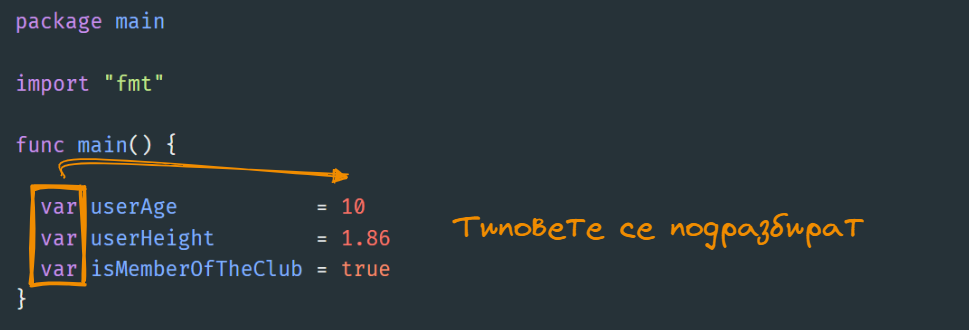

Важна особеност в Go е, че веднъж присвоен типът, той не може да се промени повече, дори да не го виждаме изрично зад кулисите компилатора казва тази променлива е само INT или FLOAT или BOOL и няма връщане назад.

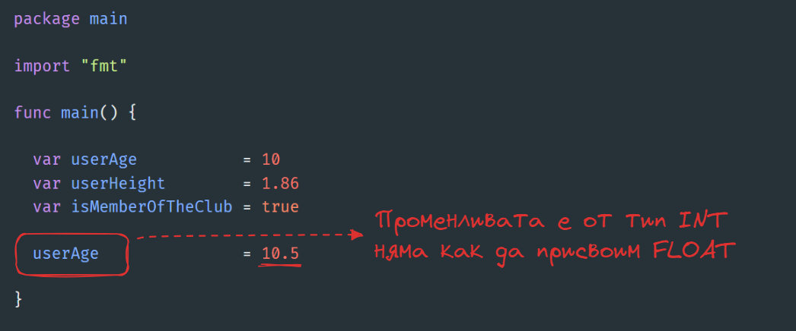

### Декларация и последващо присвояване на стойност

Ако не инициализираме веднага променливите, компилатора на GO няма идея какви типове да закачи към променливите. Поради тази причина, ако нямаме идея каква стойност да сложим, трябва изрично да добавим типът на данните непосредствено след името на променливата. 

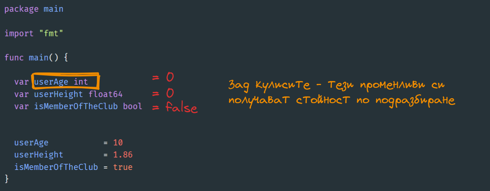

### Съкратен запис за декларация и просвояване

Ако ни мързи да пишем **var** пред името на променливата и да ползваме силата на Go да открива какъв е типът на данните, които присвояваме на променливите - можем да ползваме оператора **:=**. 

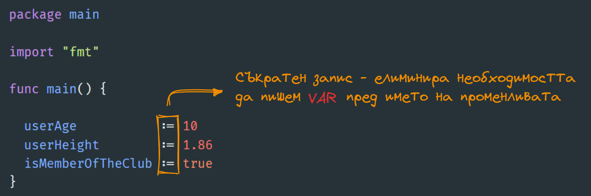

### Защо не мога да си пусна програмата - особености на Go ?
Ако сме следвали примерите до тук ще установите - че тези програми няма да могат да стартират, поради странни напръв поглед несъществуващи грешки. Go се опитва да елиминира нашата несъобразителност и разхвърляност в рамките на програмата, като предизвиква синтактична грешка в момента в която дадена променлива не е използвана в програмата.

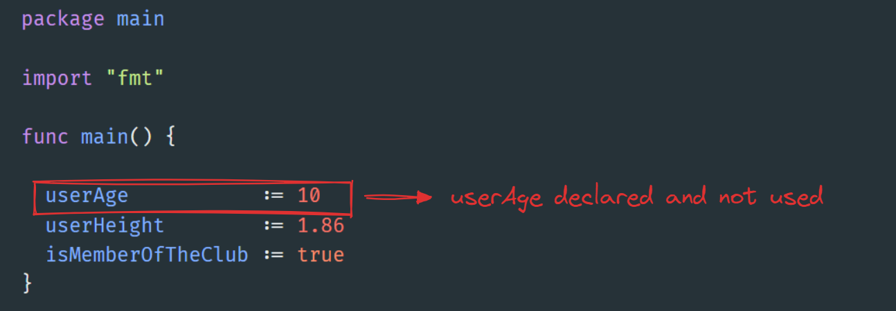

Наи лесния начин да пречупим желанието на компилатора да ни се кара е като подпъхнем променливата в рамките на някаква операция, в нашия случай такава за принтиране на текст на екрана. 

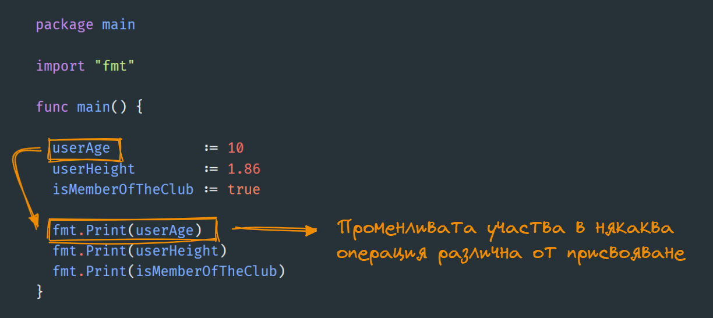